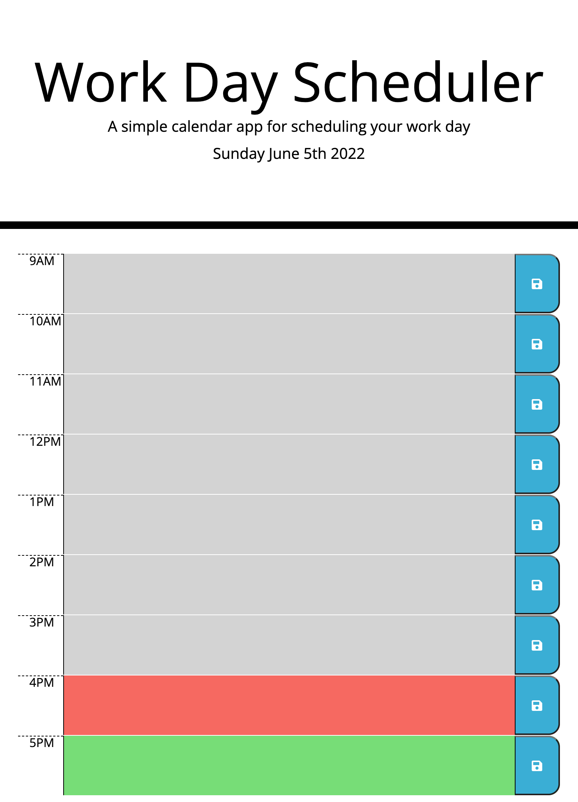

**Version 1.0**  

# Workday Scheduler 
 

## Desciption  

This project is to create a daily planner so that an employee with a busy schedule can manage their time effectively.  

### Fulfillment
GIVEN I am using a daily planner to create a schedule
WHEN I open the planner
THEN the current day is displayed at the top of the calendar
WHEN I scroll down
THEN I am presented with time blocks for standard business hours
WHEN I view the time blocks for that day
THEN each time block is color-coded to indicate whether it is in the past, present, or future
WHEN I click into a time block
THEN I can enter an event
WHEN I click the save button for that time block
THEN the text for that event is saved in local storage
WHEN I refresh the page
THEN the saved events persist
 

- - -   

### Usage  

- - -  

### Links  
 

[Workday Scheduler Website](https://bvenant.github.io/work-scheduler/)  

[Workday Scheduler repository](https://github.com/bvenant/work-scheduler) 
